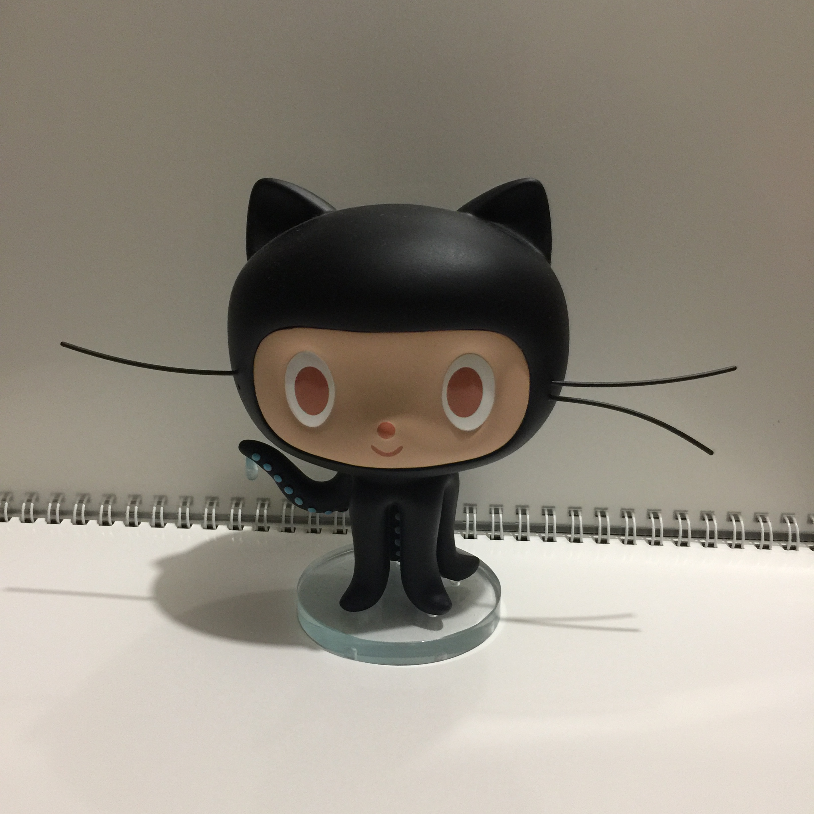
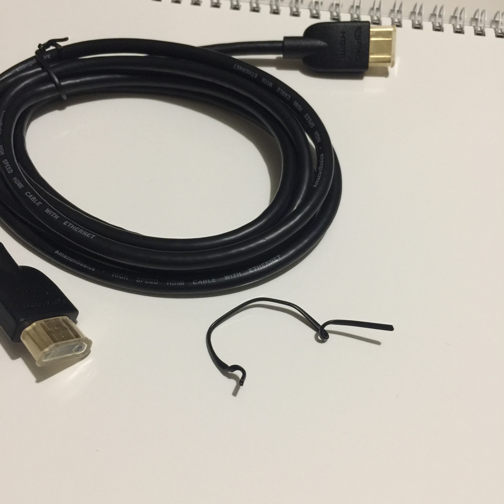
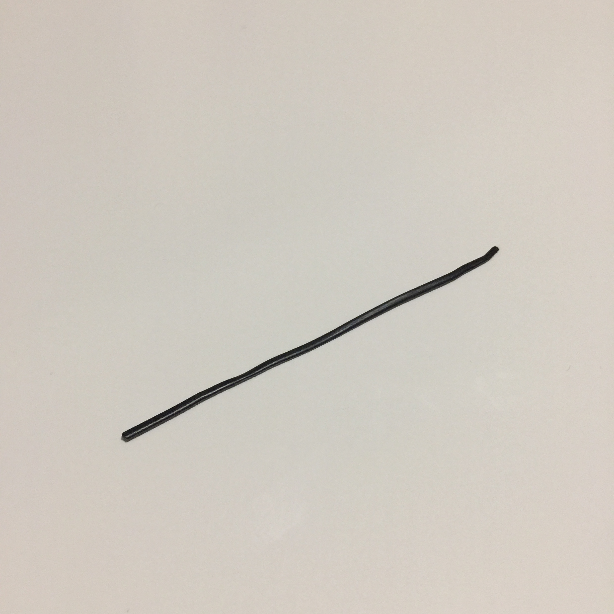
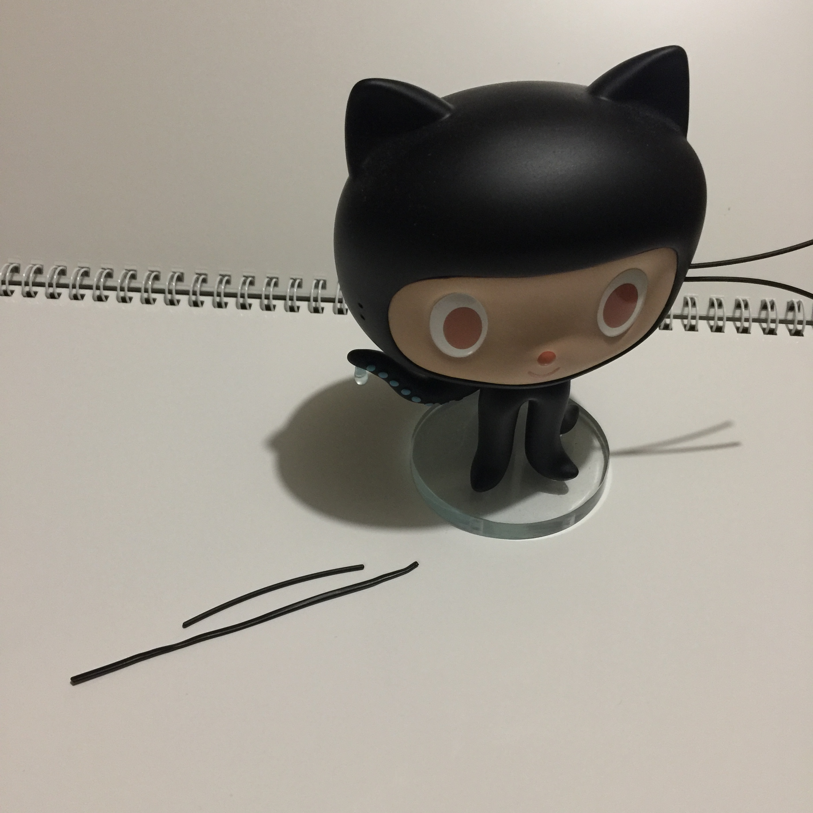
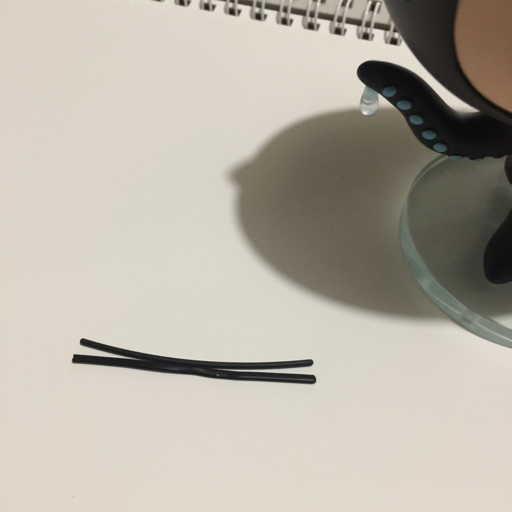
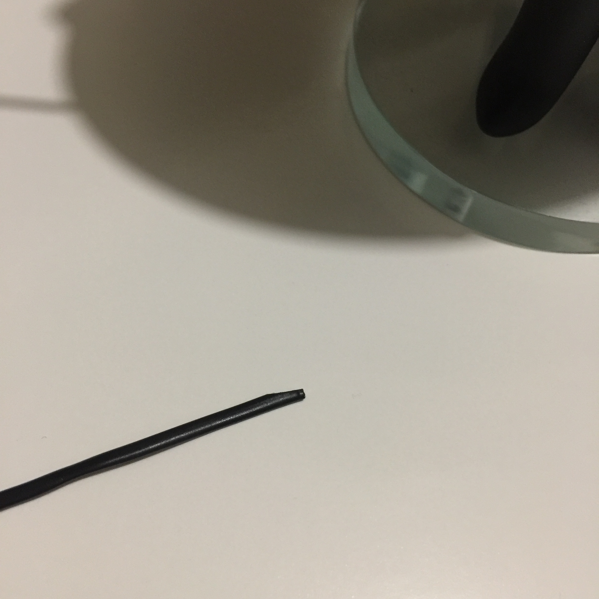
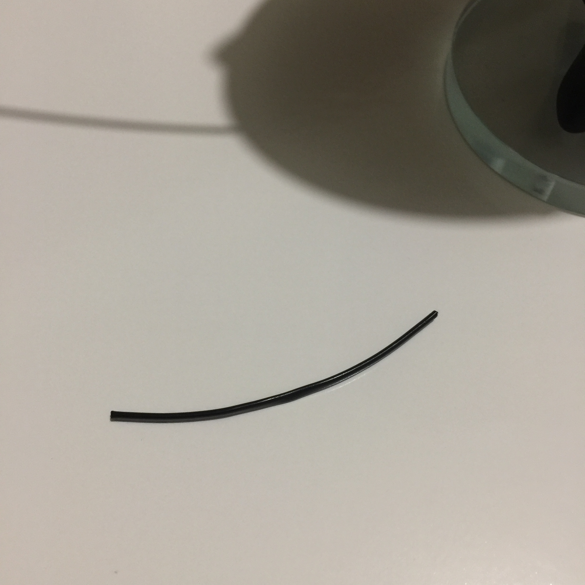
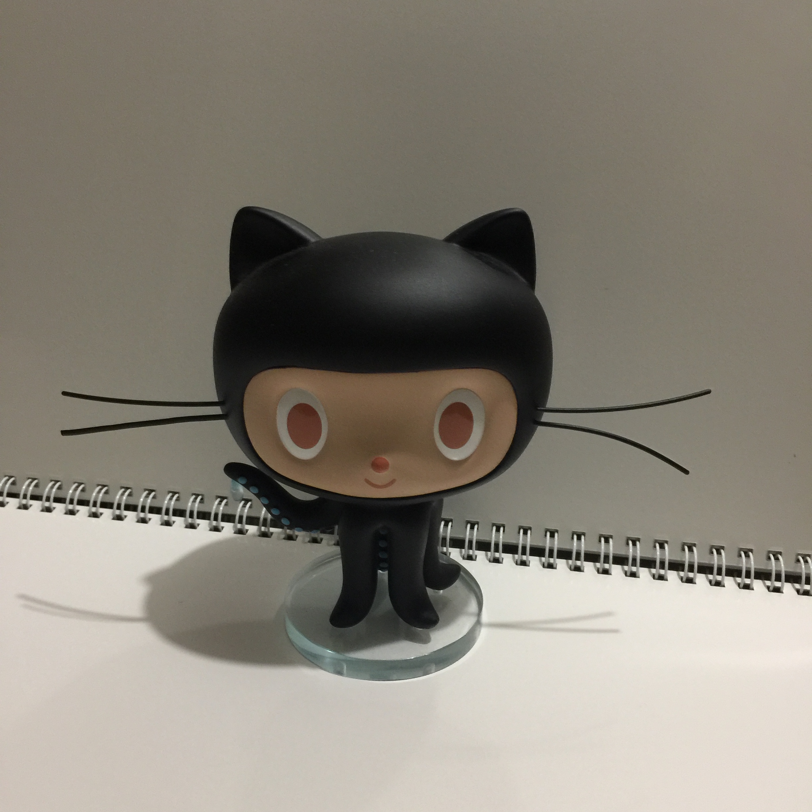
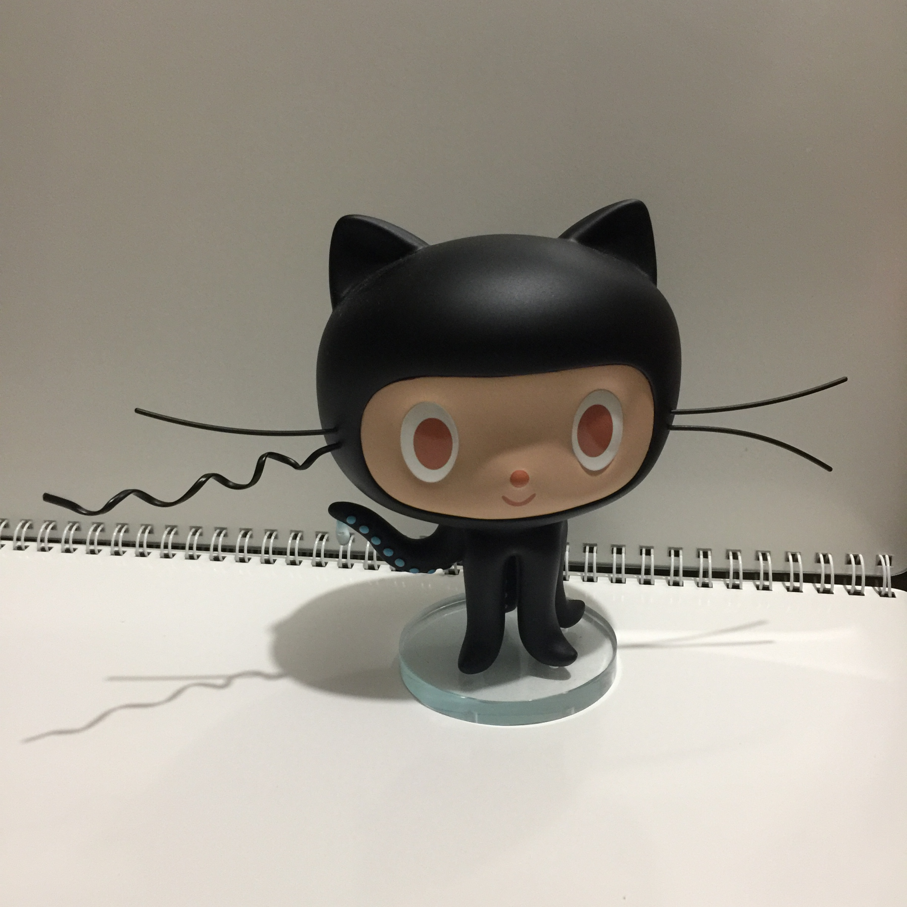

# how to repair octocat figure's whisker

:octocat: :octocat: :octocat:

:point_up: :cry:

:straight_ruler:

:triangular_ruler: :scissors:

:scissors:

:point_right: :point_left:

:point_right: :octocat:

:thumbsup:

:metal:

:octocat: :octocat: :octocat:
